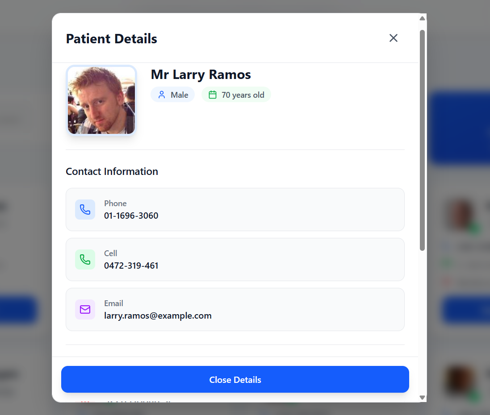

# 🏥 Jarurat Care - Patient Management System
A modern, responsive healthcare management system built with React.js and Tailwind CSS to streamline patient records management for healthcare professionals.

**Live Website:** [https://jarurattcare.netlify.app/](https://jarurattcare.netlify.app/)

## ✨ Features

### 🎯 Core Features
- **📋 Patient Records Management** - Comprehensive patient information storage
- **🔍 Advanced Search** - Quick patient search by name
- **👥 Patient Profiles** - Detailed patient information with contact details
- **📱 Responsive Design** - Works seamlessly on all devices
- **🎨 Modern UI** - Clean, healthcare-focused interface

### 🚀 Advanced Features
- **➕ Add New Patients** - Easy patient registration form
- **📊 Patient Statistics** - Real-time patient count and metrics
- **⚡ Fast Performance** - Optimized for quick loading

## 🛠️ Tech Stack

**Frontend:**
- 
- 
- 

**Backend & APIs:**
- 
- RandomUser API for demo data

**Icons & UI:**
- 

### 📸 Screenshots

### 🏠 Home Page

*Modern landing page with healthcare-focused design*

### 👥 Patients Dashboard

*Comprehensive patient management interface*

### 📋 Patient Details Modal

*Detailed patient information in modal view*

### ℹ️ About Page

*Information about Jarurat Care Foundation*

### ℹ️ Add Patient

*Information about Adding Patient*

## 🚀 Quick Start

### Prerequisites
- Node.js (version 14 or higher)
- npm or yarn

### Installation

1. **Clone the repository**
   ```bash
   git clone https://github.com/jaydipshinde123/Jarurat_Care.git
   cd Jarurat_Care
   
   npm install
   
   npm run dev
